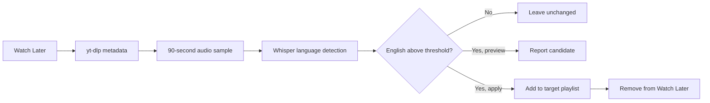

# YouTube Spoken-English Playlist Organizer

A Python tool that scans YouTube Watch Later, analyzes the first 90 seconds of each video with Whisper, and moves high-confidence English-spoken videos to a target playlist.

## Project overview

YouTube playlist organization looks simple until the signal becomes ambiguous. Titles, descriptions, and channels do not reliably identify spoken language, so this project treats language classification as an evidence-gathering step instead of a metadata guess.

The workflow samples short audio, estimates spoken language locally, reports confidence, and moves only reviewed high-confidence candidates. The design favors preview, reversibility, and human control over automatic cleanup.

## What this demonstrates

- Local AI inference for privacy-conscious media organization.
- A transaction-like browser workflow: add to the destination before removing from the source.
- Human-in-the-loop automation for uncertain classifier output.
- Clear operational boundaries around cookies, temporary audio, and playlist changes.

## Features

- Reads Watch Later with `yt-dlp` and the user's existing browser session.
- Detects spoken language locally with `faster-whisper`.
- Uses a configurable confidence threshold.
- Defaults to preview mode and requires `--apply` for changes.
- Adds a video to the destination before removing it from Watch Later.
- Deletes temporary audio automatically.
- Supports Chinese and English YouTube UI labels.

## Tech stack

- Python 3.11+
- yt-dlp
- faster-whisper
- Playwright
- FFmpeg
- Chrome on Windows

## Architecture



## Installation

Install Python 3.11+, FFmpeg, and Chrome. Then:

```powershell
python -m venv .venv
.\.venv\Scripts\Activate.ps1
pip install -r requirements.txt
playwright install chromium
```

## Usage

Close Chrome before allowing `yt-dlp` to read its cookies. Run a preview first:

```powershell
python yt_playlist_mover.py
```

Apply the reviewed moves:

```powershell
python yt_playlist_mover.py --apply `
  --playlist "English" `
  --profile-dir "$env:LOCALAPPDATA\Google\Chrome\User Data"
```

Increase the language-confidence threshold when precision matters more than recall:

```powershell
python yt_playlist_mover.py --threshold 0.9
```

## Safety model

Preview is the default. During an applied run, the tool adds the video to the destination playlist before removing it from Watch Later. If the add operation fails, the source entry remains untouched.

Browser cookies, login data, and downloaded audio must never be committed. Audio samples live only in a temporary directory and are deleted after recognition.

## Validation

The current implementation is designed around observable dry-run output and conservative browser actions. A reviewer can validate behavior by running the preview mode first, inspecting confidence scores, and applying a small approved batch only after the candidate list looks correct.

## Limitations

- YouTube UI changes may require locator updates.
- Ninety seconds may not represent multilingual or music-heavy videos accurately.
- Browser profile locking can prevent access while Chrome is open.
- The script currently resumes by rescanning rather than using a persistent checkpoint database.

## Future improvements

- JSON/SQLite checkpoints and resumable batches
- Unit tests for classification and UI transaction logic
- Configurable sampling windows
- Richer dry-run reports
- YouTube Data API support where official endpoints fit the workflow

## Medium

The English article is published on Medium:

- [How I Used Whisper to Organize YouTube Watch Later by Spoken Language](https://medium.com/@seek1andfind2/how-i-used-whisper-to-organize-youtube-watch-later-by-spoken-language-8c0e7d024215)

The source draft is available at [`docs/medium-article.md`](docs/medium-article.md).
